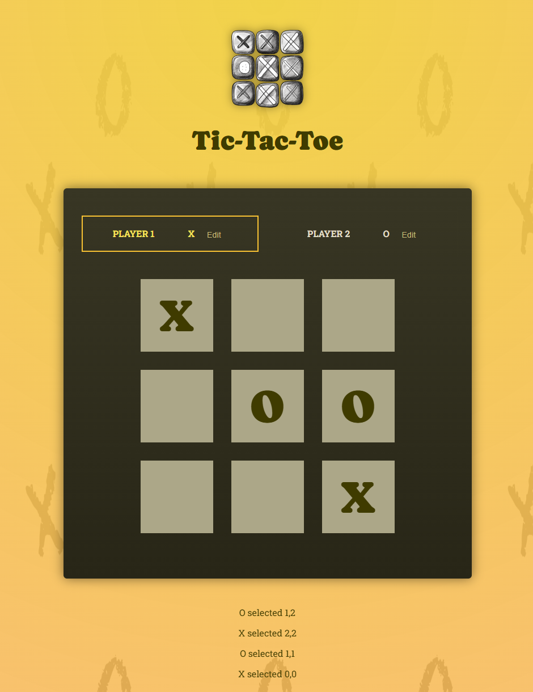

# React Tic-Tac-Toe

This is a simple Tic-Tac-Toe game built using React. It allows two players to take turns marking squares on a 3x3 grid, with a focus on fundamental React concepts such as state management and component-based design.
<br><br>


## 🚀 Getting Started

### **Prerequisites**
Make sure you have the following installed before running the project:
- **Node.js** (Download from [nodejs.org](https://nodejs.org/))
- **npm** or **yarn** (Comes with Node.js)
<br>

### **Installation**
1. Clone this repository:
   ```sh
   git clone https://github.com/nathenpriyonggo/react-tic-tac-toe/
   ```
2. Navigate to the directory
   ```sh
   cd react-essentials-tic-tac-toe
   ```
3. Install dependencies:
   ```sh
   npm install
   ```
4. Start the development server:
   ```sh
   npm run dev
   ```
5. Open ```http://localhost:5173/``` in your browser.
<br>

## 🛠️ Built With
- **React** - A JavaScript library for building user interfaces
- **Vite** - A fast build tool for modern web projects
<br>

## 🎮 Game Features
- **Turn-based play** - Players take turns marking X or O on the grid.
- **Dynamic UI updates** - The game board updates in real time based on player moves.
- **Editable player names** - Players can edit and save their names dynamically.
<br>


## 🖥️ Preview
<p align="center"></p>
<br>

## 📜 License
This project is open-source. Feel free to modify and expand upon it!
<br><br>


---

✨ Happy coding! 🚀
